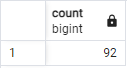
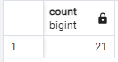

1. SELECT ROUND(AVG(rental_rate), 3) FROM film;

    

2. SELECT COUNT(*) FROM film
   WHERE title LIKE ('C%');

    

3. SELECT MAX(length) FROM film
   WHERE rental_rate = 0.99;
   
    

4. SELECT COUNT(DISTINCT replacement_cost) FROM film
   WHERE length > 150;

    